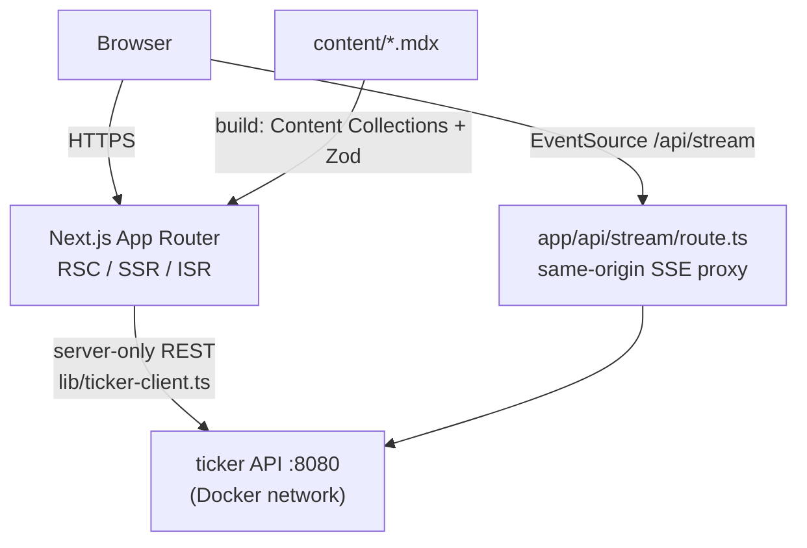

# portfolio

[](https://github.com/AkashJam/portfolio/actions/workflows/ci.yml)

Next.js App Router, RSC-first rendering, keyless CI/CD to AWS, and a design
system single-sourced in code — the presentation layer for
[akjames.dev](https://akjames.dev).

This is the frontend for the whole site: Home, About, `/projects`, `/blog`,
and the live [Market dashboard](https://akjames.dev/market), which reads and
streams from [`ticker`](https://github.com/AkashJam/ticker), a separate Go
backend. Both are deployed together by [`infra`](https://github.com/AkashJam/infra).
See the [case study](https://akjames.dev/projects/portfolio-platform) for the
write-up.


<!-- TODO: capture https://akjames.dev and commit it as docs/screenshot.png -->

## Architecture



- **Server Components by default, not the exception.** Pages fetch data
  server-side and ship minimal client JavaScript; client components are
  reserved for genuinely interactive pieces — the command palette, the mobile
  drawer, live charts — not the whole tree.
- **`/projects` and `/blog` run on Content Collections + MDX**: Zod-validated
  structured frontmatter plus a free-form MDX body, so publishing a new case
  study or post is a new file, not a schema migration.
- **How this talks to `ticker` (the "Option B" ingress model):** the browser
  never calls the Go API directly. [`lib/ticker-client.ts`](lib/ticker-client.ts)
  (`import "server-only"`) does REST reads over the Docker network;
  [`app/api/stream/route.ts`](app/api/stream/route.ts) proxies the SSE stream
  same-origin; `app/api/market/[symbol]/candles` and `app/api/palette-symbols`
  are the other proxies. One env var controls the target — `TICKER_API_URL`
  (never `NEXT_PUBLIC_`, so it can't leak to the browser): `http://localhost:8080`
  locally, `http://ticker:8080` in production. Every client function returns
  `null` on a fetch/parse failure rather than throwing, so a briefly
  unreachable `ticker` degrades a page instead of crashing it.
- **Design tokens are single-sourced** as CSS custom properties in
  [`app/globals.css`](app/globals.css), mapped into Tailwind v4's `@theme`.
  The design mockups under `mockups/` are a visual reference only — where a
  mockup and the token layer disagree, the tokens in code win.

## Quickstart (`make dev`)

```bash
npm ci
cp .env.example .env      # TICKER_API_URL=http://localhost:8080
make dev                  # next dev on :3000
```

Live market data needs [`ticker`](https://github.com/AkashJam/ticker) running
separately (see its own README's quickstart) at whatever `TICKER_API_URL`
points to. Without it, `/market` and the home page's live-stat pill render
their honest degraded/fallback state rather than erroring.

For the full contract + end-to-end test tier (real `ticker` + Redis +
Timescale, Playwright), see the `integration` job in
[`.github/workflows/ci.yml`](.github/workflows/ci.yml).

### Make / npm targets

| `make` target | runs | purpose |
|---|---|---|
| `make dev` | `next dev` | local dev server, `:3000` |
| `make build` | `next build` | production build (`output: "standalone"`) |
| `make lint` | `eslint` | lint |
| `make typecheck` | `next typegen && tsc --noEmit` | type check (route types must be generated first) |
| `make test` | `vitest run` | unit tests |
| `make e2e` | `npx playwright test` | accessibility + E2E (needs a live `ticker` stack) |
| `make check` | all of the above | the same gate CI's `build` job runs |

`npm run start` is **not** used to run the production build locally — it
doesn't work with `output: "standalone"`. Use
`node .next/standalone/server.js` with `HOSTNAME=0.0.0.0` set (see
`playwright.config.ts`'s `webServer` for the exact incantation, which mirrors
the Docker runtime image).

## Project layout

```text
app/                     App Router routes — page.tsx, layout.tsx, api/*
components/shell/        top bar, mobile drawer, command palette
components/site/         home/about building blocks (Hero, TechBanner, …)
components/market/       Market dashboard + symbol detail (charts, live badges)
components/mdx/          MDX components used inside case studies/posts (ArchFlow, Callout, …)
components/projects/     /projects grid + card
components/blog/         /blog post list + table of contents
content/projects/        case-study MDX (Zod frontmatter — see content-collections.ts)
content/blog/            blog post MDX
lib/                     ticker-client, SSE client, schemas, formatting
data/                    résumé/profile/experience/education content
```

## Deploy

CI ([`.github/workflows/ci.yml`](.github/workflows/ci.yml)) lints, typechecks,
builds, and tests every push and PR; on `main` it builds a `linux/arm64` image
and pushes it to ECR, then fires a `repository_dispatch` that triggers
[`infra`](https://github.com/AkashJam/infra)'s deploy workflow. The site is
self-hosted on one EC2 box behind Caddy, alongside `ticker`, Redis, and
TimescaleDB — see `infra`'s README for the full topology.

Required GitHub repo configuration: variables `AWS_ROLE_ARN`, `AWS_REGION`;
optional secret `INFRA_DISPATCH_TOKEN` (skips the deploy-dispatch step
cleanly if unset).
